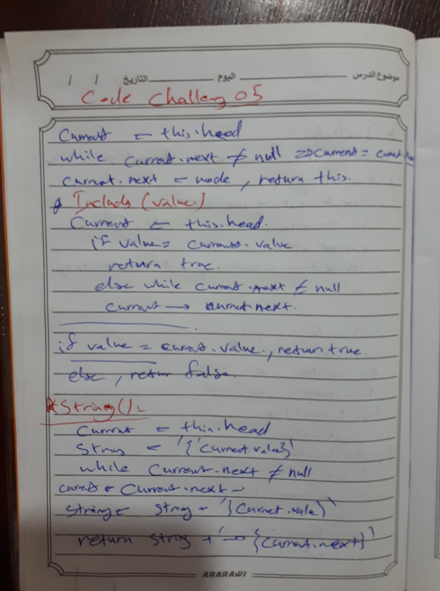
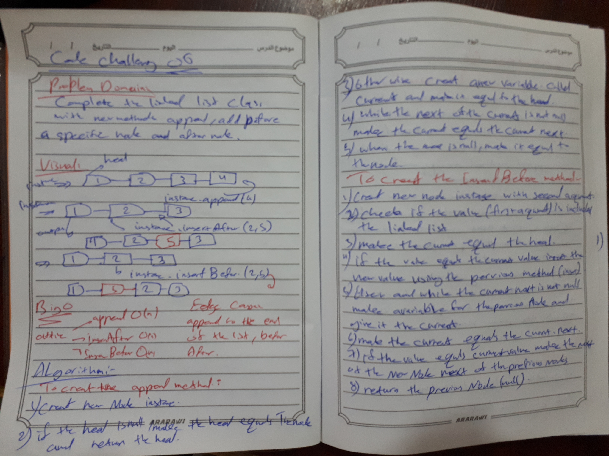

##  Linked List Implementation and Insertion
Implement the linked list concept and insertion.

### Challenge
Create a singly list with these features:

### Features

* A Node class that has properties for the value stored in the Node, and a pointer to the next Node.
* Within the LinkedList class, there is a head property. Upon instantiation, an empty Linked List is created.
* A method called insert that takes any value as an argument and adds a new node with that value to the head of the list with an O(1) Time performance.
* A method called includes that takes any value as an argument and returns a boolean result depending on whether that value exists as a Node’s value somewhere within the list.
* A method called toString which takes in no arguments and returns a string representing all the values in the Linked List, formatted as: "{ a } -> { b } -> { c } -> NULL"
* A method called append(value) which adds a new node with the given value to the end of the list
* A method called insertBefore(value, newVal) which add a new node with the given newValue immediately before the first value node.
* A method called insertAfter(value, newVal) which add a new node with the given newValue immediately after the first value node.
* A method called kthFromEnd(k) which takes a number, k, as a parameter and return the node’s value that is k from the end of the linked list.
* Exceptions or errors that come from the code is semantic, capturable errors.

### Approach & Efficiency
Created the node then a singly link list with all required methods then tested if the methods work properly.

### Solution : see the attach image
#### code chall05

#### code chall06

