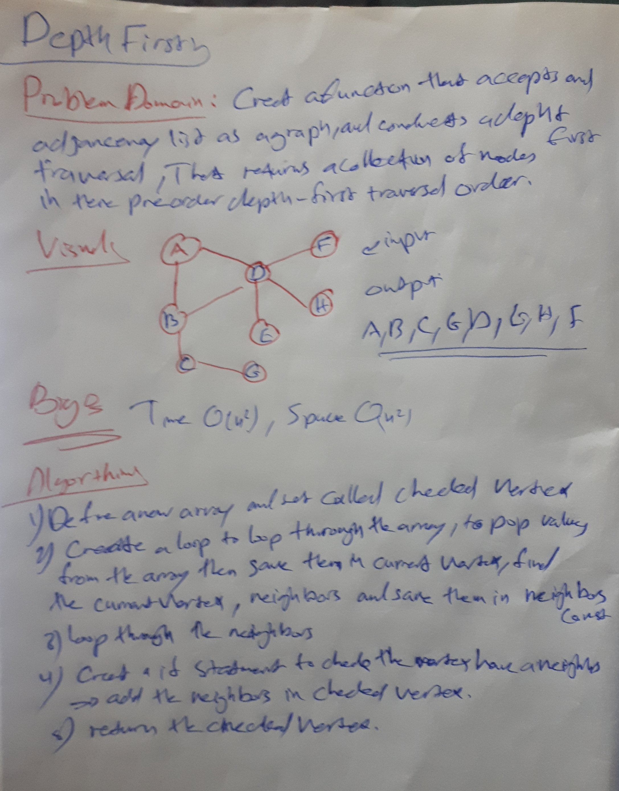

# Depth First
Conduct a depth first preorder traversal on a graph

## Challenge
Create a function that accepts an adjacency list as a graph, and conducts a depth first traversal,That returns a collection of nodes in their pre-order depth-first traversal order.

## Approach & Efficiency
addNode():-
insert vertex to the graph

addEdge():-
insert edge between two vertex

getNeighbors():-
its gonna check if there is neighbor vertex will return that vertex

getNodes():-
will entries the graph as vertexs and edges

size():-
count how many vertexs in the graph

## Solution :
